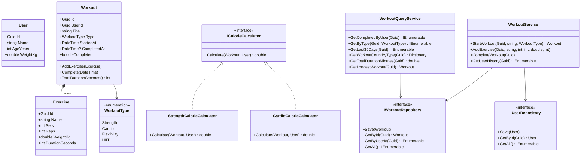

# Class Diagram

```mermaid
classDiagram
    class User {
        +Guid Id
        +string Name
        +int AgeYears
        +double WeightKg
    }

    class Workout {
        +Guid Id
        +Guid UserId
        +string Title
        +WorkoutType Type
        +DateTime StartedAt
        +DateTime? CompletedAt
        +bool IsCompleted
        +AddExercise(Exercise)
        +Complete(DateTime)
        +TotalDurationSeconds() int
    }

    class Exercise {
        +Guid Id
        +string Name
        +int Sets
        +int Reps
        +double WeightKg
        +int DurationSeconds
    }

    class WorkoutType {
        <<enumeration>>
        Strength
        Cardio
        Flexibility
        HIIT
    }

    class ICalorieCalculator {
        <<interface>>
        +Calculate(Workout, User) double
    }

    class StrengthCalorieCalculator {
        +Calculate(Workout, User) double
    }

    class CardioCalorieCalculator {
        +Calculate(Workout, User) double
    }

    class IWorkoutRepository {
        <<interface>>
        +Save(Workout)
        +GetById(Guid) Workout
        +GetByUserId(Guid) IEnumerable
        +GetAll() IEnumerable
    }

    class IUserRepository {
        <<interface>>
        +Save(User)
        +GetById(Guid) User
        +GetAll() IEnumerable
    }

    class WorkoutService {
        +StartWorkout(Guid, string, WorkoutType) Workout
        +AddExercise(Guid, string, int, int, double, int)
        +CompleteWorkout(Guid)
        +GetUserHistory(Guid) IEnumerable
    }

    class WorkoutQueryService {
        +GetCompletedByUser(Guid) IEnumerable
        +GetByType(Guid, WorkoutType) IEnumerable
        +GetLast30Days(Guid) IEnumerable
        +GetWorkoutCountByType(Guid) Dictionary
        +GetTotalDurationMinutes(Guid) double
        +GetLongestWorkout(Guid) Workout
    }

    Workout "1" *-- "many" Exercise
    Workout --> WorkoutType
    WorkoutService --> IWorkoutRepository
    WorkoutService --> IUserRepository
    WorkoutQueryService --> IWorkoutRepository
    ICalorieCalculator <|.. StrengthCalorieCalculator
    ICalorieCalculator <|.. CardioCalorieCalculator
```