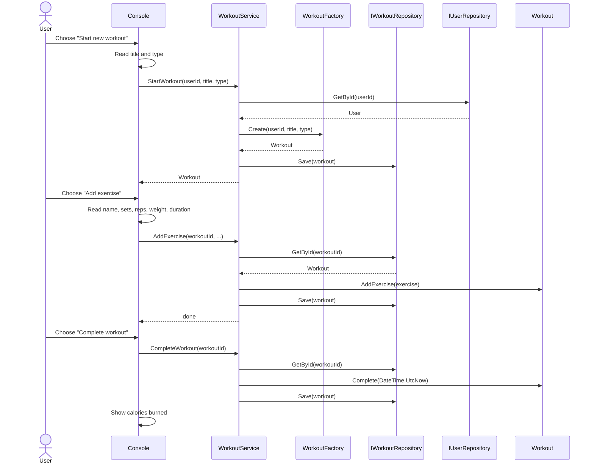

# Sequence Diagram — Start Workout and Add Exercise

```mermaid
sequenceDiagram
    actor User
    participant Console
    participant WorkoutService
    participant WorkoutFactory
    participant IWorkoutRepository
    participant IUserRepository

    User->>Console: Choose "Start new workout"
    Console->>Console: Read title and type
    Console->>WorkoutService: StartWorkout(userId, title, type)
    WorkoutService->>IUserRepository: GetById(userId)
    IUserRepository-->>WorkoutService: User
    WorkoutService->>WorkoutFactory: Create(userId, title, type)
    WorkoutFactory-->>WorkoutService: Workout
    WorkoutService->>IWorkoutRepository: Save(workout)
    WorkoutService-->>Console: Workout

    User->>Console: Choose "Add exercise"
    Console->>Console: Read name, sets, reps, weight, duration
    Console->>WorkoutService: AddExercise(workoutId, ...)
    WorkoutService->>IWorkoutRepository: GetById(workoutId)
    IWorkoutRepository-->>WorkoutService: Workout
    WorkoutService->>Workout: AddExercise(exercise)
    WorkoutService->>IWorkoutRepository: Save(workout)
    WorkoutService-->>Console: done

    User->>Console: Choose "Complete workout"
    Console->>WorkoutService: CompleteWorkout(workoutId)
    WorkoutService->>IWorkoutRepository: GetById(workoutId)
    WorkoutService->>Workout: Complete(DateTime.UtcNow)
    WorkoutService->>IWorkoutRepository: Save(workout)
    Console->>Console: Show calories burned
```